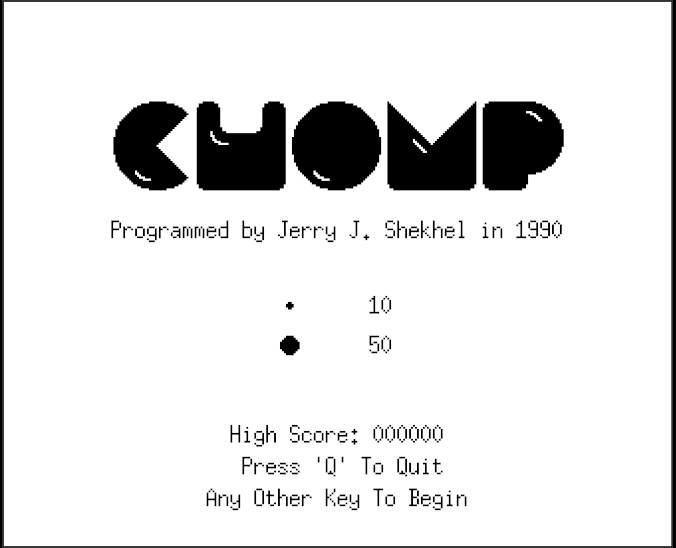

# XChomp – Web Port

### [🎮 Играть в браузере (Play Online)](https://github.io)

Classic Pac-Man™-style arcade game, ported from Jerry J. Shekhel's original X11 version (1990) to modern JavaScript/Canvas.  
The game is fully self‑contained in a single HTML file (`xchomp.html`) – no external dependencies, no server required.

## Controls

- **Arrow keys** or **W/A/S/D** – move up, down, left, right  
- **Space** – pause / unpause  
- **Q** – quit to title screen

> The game remembers the last pressed direction. Pac‑Man will turn as soon as the new direction becomes possible.

## Objective

Eat all dots on each maze to advance to the next level.  
Collect power‑dots to temporarily become able to eat ghosts.  
Fruits appear twice per level and give bonus points.

- Regular dot – **10 points**  
- Power‑dot – **50 points** + ghost‑eating mode  
- Ghost (while edible) – **200, 400, 800, or 1600 points**  
- Fruit – varies by level (up to 5000 points)

## Lives & Levels

- Start with **3 lives**.  
- Extra life awarded at **10,000 points**.  
- **6 different mazes** that cycle as you progress.  
- After clearing a maze, the screen flashes and you advance.

## How to Run

1. Obtain the file **`xchomp.html`**.  
2. Double‑click it (or open with any modern browser: Chrome, Firefox, Edge, Safari).  

> To rebuild `xchomp.html` from source, run `./build.sh` (requires npm, vite and vite-plugin-singlefile).

## Port Features

- Preserves original ghost AI (follow, run, go home, hover).  
- Pixel‑perfect 16×16 sprites rendered on Canvas.  
- Death animation rotates to match Pac‑Man's facing direction.  
- Pause on Space, exit to demo on Q.  
- All status messages (`READY!`, `GAME OVER`, score, lives, level) match the original.

## History

Jerry J. Shekhel wrote the original `xchomp` in 1990 for X11 and placed it in the public domain.  
This JavaScript port keeps the gameplay, sequences, and even variable names to honor the classic.

## Credits

- Jerry J. Shekhel – original game  
- Karl Asha – Linux compilation notes  
- Web port testers

---

**Enjoy!**  
*If you find a bug or have a suggestion, please open an issue or pull request.*